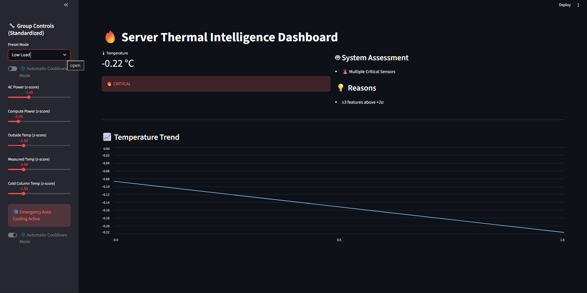
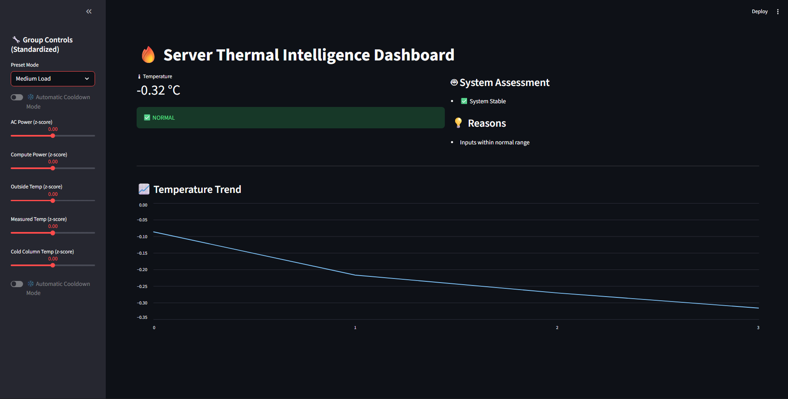
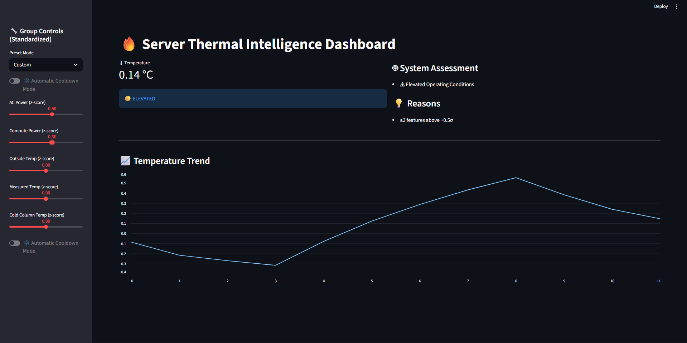
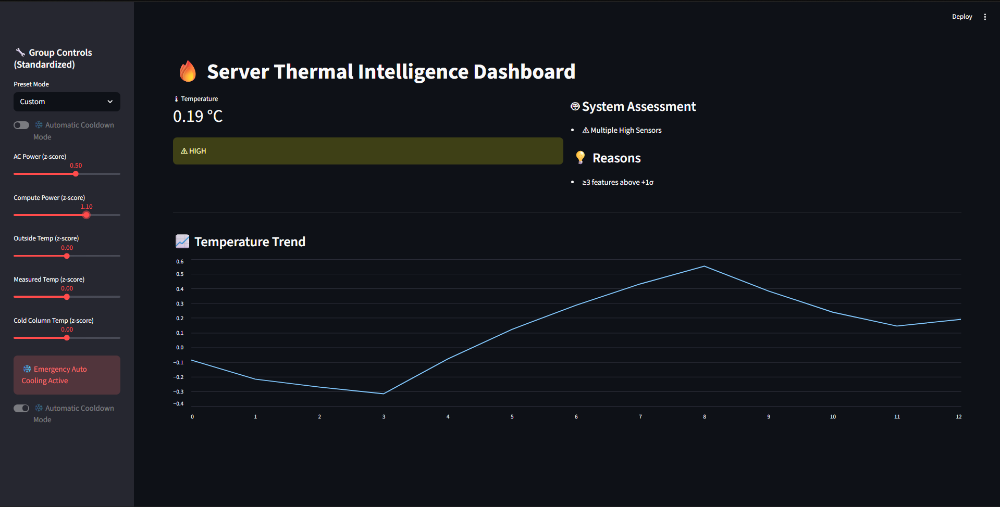
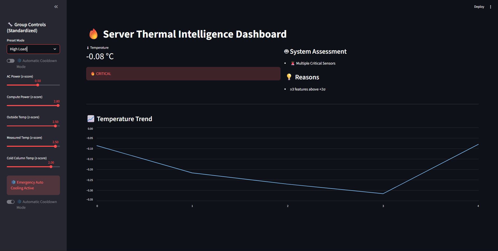

# 🔥 Server Thermal Intelligence


A modular **machine learning system for server temperature prediction and autonomous cooling simulation** built with Streamlit.

This project simulates how a data center monitoring system could predict **hot-corridor temperatures** and trigger **automated cooling responses** to reduce thermal risk.

---

## 📊 Dashboard Scenarios

<table>
<tr>
<td align="center">

### Low Load


</td>
<td align="center">

### Normal Load


</td>
</tr>

<tr>
<td align="center">

### Elevated State


</td>
<td align="center">

### High State


</td>
</tr>
</table>

### Automatic Cooling Activated



When the system detects high thermal risk, the autonomous cooling controller automatically adjusts conditions to stabilize the temperature.

## 🚀 Project Overview

Modern data centers must continuously manage temperature to avoid:

- Hardware failures  
- Energy inefficiency  
- Cooling overuse  
- Thermal hotspots  

This project simulates an **AI-assisted thermal monitoring system** that:

- Predicts server hot-corridor temperature  
- Evaluates operational risk  
- Detects abnormal sensor conditions  
- Simulates autonomous cooling responses  
- Visualizes system behavior through an interactive dashboard  

---

## 🧠 System Architecture

```
server-thermal-intelligence/
│
├── app/                # Streamlit dashboard (UI layer)
├── src/                # Core ML & control logic
├── notebooks/          # Model training pipeline
├── data/               # Dataset
├── models/             # Generated model artifacts (ignored in Git)
├── requirements.txt
└── README.md
```

### Design Principles

- Separation of ML logic from UI
- Modular architecture
- Reproducible training workflow
- Safe model loading
- Lightweight repository

---

## ⚙️ Technology Stack

| Category | Tools |
|--------|------|
| Language | Python |
| Machine Learning | Scikit-learn, XGBoost |
| Data Processing | Pandas, NumPy |
| Model Persistence | Joblib |
| Dashboard | Streamlit |
| Version Control | Git |

---

## 🏗 How the System Works

1. Environmental features are standardized  
2. An ensemble ML model predicts TLHC temperature  
3. Prediction is converted back to real temperature scale  
4. Thermal inertia simulates physical lag  
5. Risk probability is calculated  
6. Severity is evaluated  
7. Autonomous cooling logic adjusts system behavior  
8. Dashboard visualizes temperature trends and system state  

This models a simplified **closed-loop thermal control system**.

---

## 📌 Key Features

- Ensemble ML temperature prediction  
- Thermal inertia simulation  
- Risk probability modeling  
- Severity classification (Normal / Elevated / High / Critical)  
- Autonomous cooling controller  
- Temperature trend visualization  
- Modular architecture separating ML and UI  

---

## ▶️ Running the Project

### 1️⃣ Install dependencies

```bash
pip install -r requirements.txt
```

### 2️⃣ Train the model

Open the training notebook:

```
notebooks/training.ipynb
```

Run all cells to generate model artifacts:

```
models/ensemble_model.joblib
models/feature_names.joblib
```

### 3️⃣ Launch the dashboard

```bash
streamlit run app/streamlit_app.py
```

If model files are missing, the application will display a message prompting you to train the model.

---

## 📦 Why Model Files Are Not Included

Trained model artifacts are excluded because:

- Large binary files slow down Git repositories  
- Models can be regenerated through the training notebook  
- This follows standard ML project practices  

---

## 🔮 Future Improvements

- Deploy dashboard to cloud platforms (AWS / Azure)  
- Add REST API using FastAPI  
- Docker containerization  
- Real-time sensor streaming simulation  
- Reinforcement learning based cooling control  

---

## 📄 License

This project is intended for **educational and portfolio purposes**.